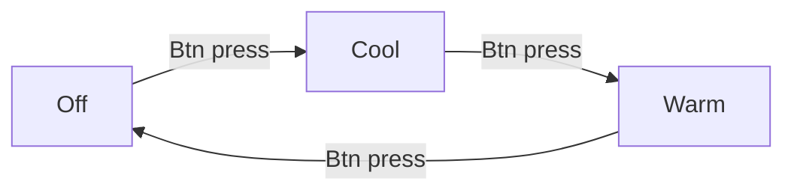

# ESPHome Diffuser

A ESPHomified aroma diffuser to work as an controllable humidifier through Home Assistant

# Problem

My partner, [Amanda Lohne](https://amandalohne.com/), is making an [IKEA Greenhouse](https://www.reddit.com/r/IkeaGreenhouseClub/) with an IKEA FABRIKÖR cabinet. This cabinet will be sealed off to maintain high levels of moisture. To create the moisture, she's bought an aroma diffuser which will be filled with water. We could build a mist maker ourselves (check out the #theory section), but we saved ourselves some work and also got a ready made case and water container with a store bought diffuser.

The problem is that this diffuser only has two modes:
- One button press: always on
- Hold button for 3 seconds while on: on/off interval of 10 seconds

Since we want to be able to set the humidity at a specific level, this is not sufficient. 

The diffuser also has a warm or cool light which is controlled by a single button with this flow:

# Solution

I therefore frankensteined it and added a Wemos D1 Mini to hijack the circuit board. Soldered a wire to the positive connection point of each button.

| Wemos Pin | Connection point on diffuser PCB       | Comments  |
|-----------|----------------------------------------|-----------|
| D5        | Mist button                            |           |
| D6        | Light button                           |           |
| A0        | Ultrasonic mist maker power connection | To measure the voltage and know if the mist maker actually was on or not | 
| 5V        | Capacitor connection                   | Found this connection point by trial and error. Had the USB voltage and everything seemed to work as it should |
| GND       | Random GND point                       |    | 

# Theory
|   |   |
|---|---|
| |  |
