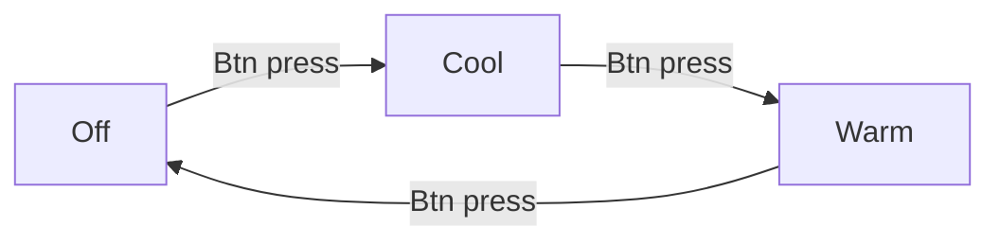

# ESPHome Diffuser

A ESPHomified aroma diffuser to work as an controllable humidifier through Home Assistant

https://user-images.githubusercontent.com/30476405/200193576-415818a4-d338-4237-9c56-8fed2da2a92a.mp4

# Problem

My partner, [Amanda Lohne](https://amandalohne.com/), is making an [IKEA Greenhouse](https://www.reddit.com/r/IkeaGreenhouseClub/) with an IKEA FABRIKÖR cabinet. This cabinet will be sealed off to maintain high levels of moisture. To create the moisture, she's bought an aroma diffuser which will be filled with water. We could build a mist maker ourselves (check out the [theory section](https://github.com/petrepa/ESPHome-Diffuser/blob/main/README.md#theory)), but we saved ourselves some work and also got a ready made case and water container with a [store bought diffuser](https://www.ebay.com/itm/134066518332).

The problem is that this diffuser only has two modes:
- One button press: always on
- Hold button for 3 seconds while on: on/off interval of 10 seconds

Since we want to be able to set the humidity at a specific level, this is not sufficient. 

The diffuser also has a warm or cool light which is controlled by a single button with this flow:


# Solution

I therefore frankensteined it and added a Wemos D1 Mini to hijack the circuit board. Soldered a wire to the positive connection point of each button.

| Wemos Pin | Connection point on diffuser PCB       | Comments  |
|-----------|----------------------------------------|-----------|
| D5        | Mist button                            |           |
| D6        | Light button                           |           |
| A0        | Ultrasonic mist maker power connection | To measure the voltage and know if the mist maker actually was on or not | 
| 5V        | Capacitor connection                   | Found this connection point by trial and error. Had the USB voltage and everything seemed to work as it should |
| GND       | Random GND point                       |    | 

<details>
  <summary><h2>Build process</h2></summary>
  Pop the lid by unscrewing some screws.
  
  
  
  Finding the connections.
  
  
  
  

  Put it all together

  
  
  Last bit of circuit isolation 🤪🤪
  


</details>

# Home Assistant Integration
Using [ESPHome](https://esphome.io/) to configure the module, we can easily integrate and automate the diffuser in [Home Assistant](https://www.home-assistant.io/). The ESPHome yaml can be found [here in the files](https://github.com/petrepa/ESPHome-Diffuser/blob/main/greenhouse-humidifier.yaml).

This gives us a switch for the misting function. By combining this with a separate humidity sensor (or adding one directly to the diffusor), in our case a [Xiaomi BT Home](https://bthome.io/) enabled multi sensor, we can creating a humidifier entity in Home Assistant with the [generic hygrostat integration](https://www.home-assistant.io/integrations/generic_hygrostat/). 

```yaml
# Add to configuration.yaml and reboot your HA server
generic_hygrostat:
  - name: Living Room Greenhouse
    humidifier: switch.greenhouse_humidifier
    target_sensor: sensor.living_room_multi_sensor_humidity

```


# Theory
|   |   |
|---|---|
| [](https://www.youtube.com/watch?v=OOZi3QnnDCo&ab_channel=GreatScott%21) | [](https://www.youtube.com/watch?v=aKhPj7uFD0Y&ab_channel=GreatScott%21) |


